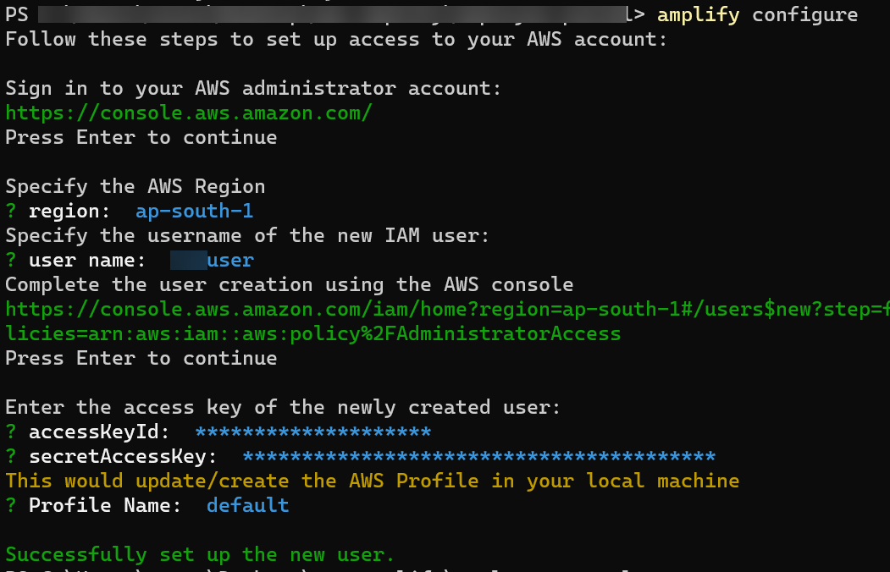

# AWS Amplify to host React frontend with Cognito authentication

AWS Amplify is a set of purpose-built tools and features that lets frontend web and mobile developers quickly and easily build full-stack applications on AWS, with the flexibility to leverage the breadth of AWS services as your use cases evolve. AWS Amplify Hosting is a fully managed CI/CD and hosting service for fast, secure, and reliable static and server-side rendered apps that scale with your business. It supports modern web frameworks such as React, Angular, Vue, Next.js, Gatsby, Hugo, Jekyll, and more.

Amazon Cognito lets you add user sign-up, sign-in, and access control to your web and mobile apps quickly and easily. Amazon Cognito scales to millions of users and supports sign-in with social identity providers, such as Apple, Facebook, Google, and Amazon, and enterprise identity providers via SAML 2.0 and OpenID Connect.  

## Prerequisites
* AWS Account with Administrator access
* AWS Amplify CLI
* NodeJS 14.x or later
* Visual Studio Code
* Git for Windows/Linux
* GitHub account

## What you will learn:
1) Install and configure AWS Amplify CLI
2) Host your React frontend using AWS Amplify with GitHub
3) Create a service role for AWS Amplify build process
4) Configure Amplify on React application locally
5) Enable authentication for React application using Cognito user pool
 
## Install and configure AWS Amplify CLI
1) Before you start configuring the application with AWS amplify you need to deploy the AWS Amplify CLI on local development machine. Verify the NodeJS version before installing the AWS amplify CLI.
    ```bash
    node --version
    ```
2) Make sure the latest versions of NodeJS is installed in your machine. Ensure it is 14.x or later version of NodeJS runtime.
3) Install the AWS Amplify CLI globally by running the following command.
    ```bash
    npm install -g @aws-amplify/cli
    ```
4) Amplify CLI uses the IAM user account to create and manage AWS resources for you. You need to create an IAM user with administrative access. Immediately after you install the Amplify CLI, you need to run the following command to configure the IAM user credentials for CLI.
    ```bash
    amplify configure
    ```
5) This command will take you through a series of steps to create an IAM administrator user. If you have user created already you can speicify the username and skip the user creation step. Specify the `Access Key ID` and `Secret Access Key` of user when prompted. 

    

## Host your React frontend using AWS Amplify with GitHub
1) Open the command terminal and  Open the command window/terminal and switch the current directory to 
2) 